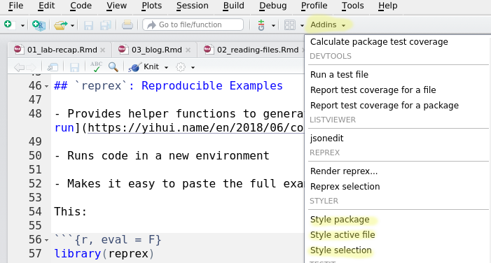

class:center,middle
# Reproducibility

---

## Minimal Working Example
<br/><br/>

> A collection of source code and other data files which allows a bug or problem to be demonstrated and reproduced<br/>- The [all knowing Wikipedia](https://en.wikipedia.org/wiki/Minimal_working_example)

<br/><br/>
- Enough to demonstrate the problem

<br/>
- No additional complexity or dependencies

<br/>
- StackOverflow thread: [How to make a great reproducible example](https://stackoverflow.com/questions/5963269/how-to-make-a-great-r-reproducible-example/16532098)

---

## Reproducing Errors

- In order to get help, you need to be able to demonstrate (and reliably reproduce) the error

- The process of making the error repeatable is a valuable diagnostic

<br/><br/>

.center[<iframe width="560" height="315" src="https://www.youtube-nocookie.com/embed/rfbb4yRBH64" frameborder="0" allow="accelerometer; autoplay; encrypted-media; gyroscope; picture-in-picture" allowfullscreen></iframe>]

---

## `reprex`: Reproducible Examples

- Provides helper functions to generate a good reproducible example (the [copy and run](https://yihui.name/en/2018/06/copy-and-run/) principle)

- Runs code in a new environment

- Makes it easy to paste the full example into GitHub or StackOverflow

This: 

```{r, eval = F}
library(reprex)
reprex(rbinom(3, size = 10, prob = 0.5))
```
Copies this to the clipboard: 
````
``` r
rbinom(3, size = 10, prob = 0.5)
#> [1] 5 4 7
```

<sup>Created by the [reprex package](https://reprex.tidyverse.org)
(v0.2.1)</sup>
````
---
class:center,middle
# Do's and Don'ts

---

## Data

- Should be: small, simple, built-in (if possible)
    - `iris`, `mtcars` ... boring data
    
- If you have to use your own data

    - minimal number of rows    
        `head` or `sample()`

    - create it inline with    
    `tibble::tribble` or     
    `read.csv(text = "a, b\n1, 2\n3, 4")`

    - `dput()` creates the code to generate an object
    
---

## Data

```{r}
dput(head(mtcars, 2))
```

---

## Minimal Code

- Remove any commands unrelated to the issue

- Include every command that is required - including loading all packages

```{r, error = T, fig.show = 'hide', out.width = "10%"}
library(repurrrsive) # totally not necessary

# This code does something
library(ggplot2) 
a <- 1:10
b <- 6:15
qplot(a, b)

# This code does something else
c <- function(x) x*x
c(2, 3, 4) 

```

---

## Minimal Code

- Remove any commands unrelated to the issue

- Include every command that is required - including loading all packages

```{r, error = T, fig.show = 'hold', out.width = "10%"}
# This is the code that causes the problem
c <- function(x) x*x
c(2, 3, 4) 

```

.center[Figuring out what is and isn't required to reproduce the error <br/>often helps you fix it]

---

## Include your Session Info

```{r, eval = F}
# base R
sessionInfo()

# devtools - data frame version
devtools::session_info()

# reprex
reprex(..., si = T) 
# Includes your session info at the end of the reproducible example
```

---

## Use good coding style

```{r, eval = F}
reprex(..., style = T) # Auto-styles your code
```

Check out the [tidyverse style guide](https://style.tidyverse.org/)!

Use the `styler` package:

  - RStudio addin
  
  - Functions to clean and properly space your code

Styler addins:
.center[]
---

## Be nice

- You are asking for help from someone else:    
[Make it easy for them to help you](https://yihui.name/en/2018/05/github-issue-format/)!

- Treat their computer nicely:

  - Clean up after yourself (downloaded files, objects)
  
  - Leave the environment the same way you found it    
  Don't `rm(list = ls())` - you could delete someone else's data
  
  - If you change options, store their values first
  
  - Don't redefine built-in functions
  
  - Make use of `tempfile()` and `tempdir()`
    

---

## Be considerate

- If you must have external file(s): 

  - One file: Show the content in the issue using `dput()`
  
  - More than one file: 
      1. Zip the files
      2. upload
      3. use `download.file()` and `unzip()` to include them in your code
      4. delete the downloaded files at the end of your code
      
---
class:inverse
## Your Turn

This [StackOverflow post](https://stackoverflow.com/questions/54681964/r-how-to-reorder-the-groups-and-add-legend-at-bottom-with-ggplot-geom-bar) (https://bit.ly/2URU8K6) does not have a minimal working example. 

- Create a minimal example that reproduces the issues mentioned in the post

- Ensure that all of the code runs

- Use `reprex()` to turn your code into a fully reproducible example

---

## Reproducibility and Blog Posts

- Be considerate: Don't commit large (>3Mb) data files to the community github repo.    
Other options:
  - Upload the file to your own "data" repo and link to it in your Rmd file
  - Use a built-in data file that demonstrates the same knowledge
  - Download the file from a web source, read it into R, and then delete the downloaded file
  
- Avoid using paths that are specific to your computer
  - Web links
  - Local paths (e.g. `../` to go up one directory, `../../`)

- Don't change working directories - this doesn't always work well with rmarkdown
  
---

## Reproducibility and Blog Posts

- Make sure your code runs in a new, clean R session!

- If you use an obscure package, check to see if it's installed and install it as part of your document

```{r}
if (!"beepr" %in% installed.packages()) {
  install.packages("beepr")
}
library(beepr) # Play a sound when the script is done!
```
    