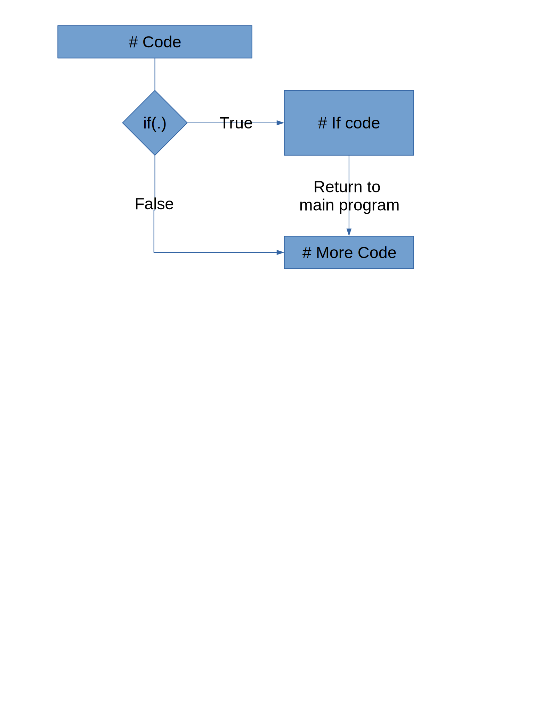
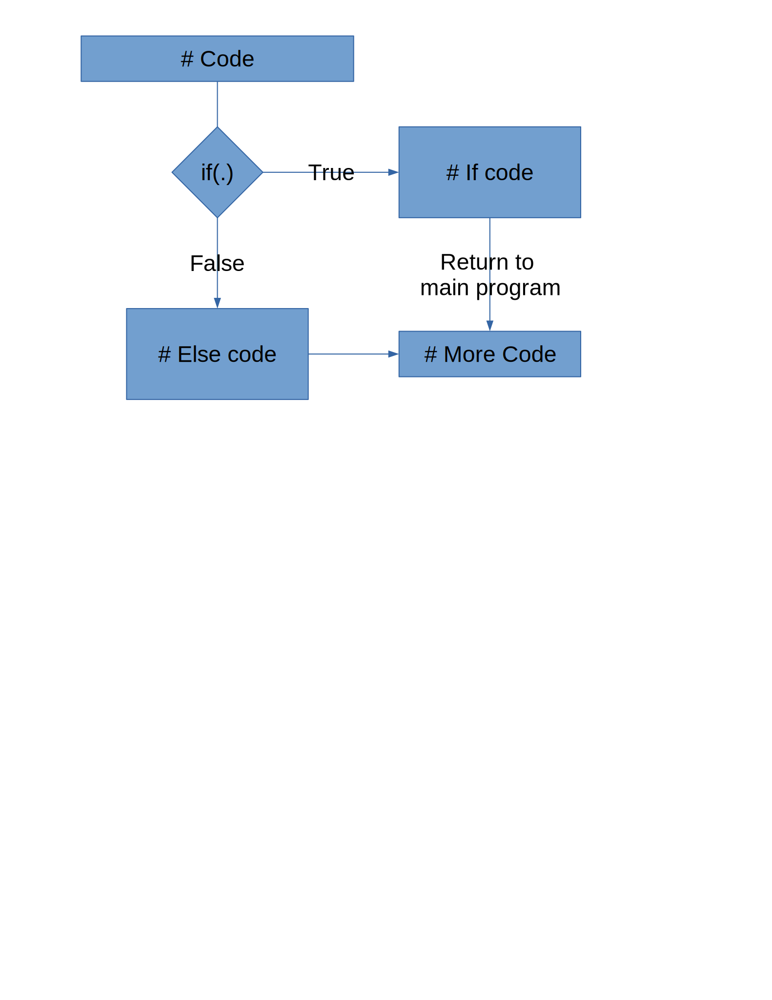

```{r setup, include=FALSE}
options(htmltools.dir.version = FALSE)
```

## Functions in R

- We use functions all the time

- What if there isn't a built-in or package function?

- Idea: avoid repetitive coding (errors, hard to maintain)

- Instead:

--

  - Extract common operations
  
--

  - Wrap in a function
  
--

  - Reuse
  
---

## Basic Structure

- Name

- Input arguments
  - names
  - default value

- Body

- Output values

---

## A first function

```{r, echo = T}
mymean <- function(x) {
  avg <- sum(x)/length(x) # body

  return(avg) # return value - alternatively we could just write `avg`
}

mymean(1:15)
mymean(c(1:15, NA))
```

we want to deal with missing values more gracefully
---

## A first function - take 2

Parameters can have default values. 
Those values are included in the function specification

```{r, echo = T}
mymean <- function(x, na.rm = F) {
  # If na.rm is T, delete the missing value from x
  
  return(sum(x)/length(x))
}


mymean(1:15)
mymean(c(1:15, NA), na.rm=TRUE) # still doesn't do what we want
```


---

## Conditionals

```{r conditionals, eval = F}
if (condition) { # only one set of commands  
  statement      # is executed depending on 
} else {         # whether condition is true
  statement      # or false
}
```

- Condition is a logical **value** (`TRUE` or `FALSE`), i.e. has to be of length 1

- Use `&` and `|` to combine several conditions

- `!` negates a condition (`!FALSE` is `TRUE`)

---

## Conditionals - if()



---

## Conditionals - ifelse 


---

## A first function - take 3

```{r}
mymean <- function(x, na.rm = F) {
  if (na.rm == TRUE) {
    x <- na.omit(x)
  }
  
  return(sum(x)/length(x))
}

mymean(1:15)
mymean(c(1:15, NA), na.rm = F)
mymean(c(1:15, NA), na.rm = T)
```

---

## Function `mymean`

|     |     |
| --- | --- |
| Name | `mymean` |
| Input arguments | `x, na.rm = T` |
|                 | names of parameters, default values | 
| Body | `if (na.rm) x <- na.omit(x)` | 
| | `avg <- sum(x)/length(x)` |
| Output | `return(avg)` |

---

## Function Writing

- Start simple, then extend

- Test out each step

- Don't try too much at once


---
class: inverse
## Your turn

- Write a function `sd` that computes the standard deviation of `x` "from scratch". Include a parameter `na.rm` in it

- $L(\lambda; x) = -n\lambda + log(\lambda) \cdot\sum x_i$ is the log likelihood function of a Poisson variable x with parameter $\lambda > 0$
  - Write a function `loglikpois` with parameters `lambda` and `x` (a vector) that computes the log likelihood value for lambda given observations `x`.
  - Make sure to check that `lambda` is positive; return an error message (using `stop()`) if it is not.
  - Plot the likelihood values for lambda between 0 and 10 for `x = c(1, 3, 2, 3, 0, 1, 0, 1, 3, 3)`
  
---

## Good Practice

- Use tabs to structure blocks of statements

- Build complex blocks of codes step by step
    - A function should complete one task
    - Chain multiple functions together with a meta-function for more complex tasks

- `# write comments!`


---

## Testing

- Always test your functions!
    - Check input types - #1 source of issues

- Even better: Have someone else test them for you

---

## When Things Go Wrong...

Debugging is an art, not a science

- By yourself
  - check your code step by step
  - explain your code to an inanimate object    
  .small[(traditionally, a rubber duck)]
  - include print statements to check intermediate results and assumptions
  - use `browser()`
  - investigate all warnings
  
- Ask a friend to look over your code <div style='position:relative; padding-bottom:calc(51.54% + 44px)'><iframe src='https://gfycat.com/ifr/ShockedSmoggyAnkole' frameborder='0' scrolling='no' width='50%' height='50%' style='position:absolute;top:0;left:0;' allowfullscreen></iframe></div><p></p>

---

## First go to when you get an unexpected result

Placing output such as

- `cat()`
- `str()`
- `head()`
- `summary()`
- `print()`

in strategic places in functions,
are simple ways to build code up step-wise ensuring that each piece works (and figuring out where it fails)

---

## Example: Read code

What does this function do? How does it work?

```{r eval = FALSE}
somefunction <- function (...) 
{
    k <- length(ll <- list(...))
    if (k == 0L) 
        return(invisible())
    mc <- match.call()
    for (i in 1L:k) if (!(is.logical(r <- ll[[i]]) && !any(is.na(r)) && 
        all(r))) {
        ch <- deparse(mc[[i + 1]], width.cutoff = 60L)
        if (length(ch) > 1L) 
            ch <- paste(ch[1L], "....")
        stop(paste(ch, " is not ", if (length(r) > 1L) 
            "all ", "TRUE", sep = ""), call. = FALSE)
    }
    invisible()
}
```

<!-- precursor of the stopifnot function -->

---

## Step-by-step code checking

The `browser()` function allows stepping through your code.

```{r}
help(browser)
```

- `n`= executes the next line of code

- `c`= continue execution until the end of the function, and exit

- `where` gives you the stack information, the trace of the active function calls

- `Q` exits browser()

---

## Let's try browser()

`somefunction2()` function has `browser()` in first line of function

```{r}
somefunction2 <- function (...) 
{
    browser()
    k <- length(ll <- list(...))
    if (k == 0L) 
        return(invisible())
    mc <- match.call()
    for (i in 1L:k) if (!(is.logical(r <- ll[[i]]) && !any(is.na(r)) && 
        all(r))) {
        ch <- deparse(mc[[i + 1]], width.cutoff = 60L)
        if (length(ch) > 1L) 
            ch <- paste(ch[1L], "....")
        stop(paste(ch, " is not ", if (length(r) > 1L) 
            "all ", "TRUE", sep = ""), call. = FALSE)
    }
    invisible()
}
```

---

```{r eval = FALSE}
x <- 1
somefunction2(x==x, 1+1==2, c(7+5==11.99999, 1+1==2))
```

Browser enables:

- printing of result of each line

- checking changes to values

- make sure that it results in what is expected

---

## `debug()`

- `debug(f)` <br>
automatically places a `browser()` statement in the first line of function `f`, i.e. browser starts every time the function `f` is being executed

- `undebug(f)` <br>
removes it.

-  `debugonce(f)` <br>
Convenient alternative: starts the browser the next time function `f` is being executed


---

## Setting error handling


- `options(error=recover)` will drop user into `browser()` upon an error

- `options(error=NULL)` default, do nothing

- `options(warn=2)` sets maximum number of warnings to be 2

- `options(warn=0)` warnings are stored until top level function finishes (default)

- `options(warn=-1)` ignore all warnings

---

## Traceback

`traceback()` shows the stack at the time the last error occurred
```{r eval=FALSE}
f <- function(x) { 
  w(x)
	g(h(x)) 
	w(x)
} 
g <- function(x) {
	a <- 10
	x
} 

h <- function(x) {
	w(x) 
	w(x) 
}
	 
w <- function(x) { 
	if (sample(10, 1) == 1) stop("This is an error!")
}

f() 
traceback()
```

---

## Traceback

  
```
> f()
Error in w(x) : This is an error! 
> traceback()
5: stop("This is an error!") at #2
4: w(x) at #2
3: h(x) at #3
2: g(h(x)) at #3
1: f()
```
---
class: inverse
## Your Turn: fix this!! (8 mins)

`larger(x,y)` is supposed to return the element-wise maximum of two vectors

```{r}
larger <- function(x, y) { 
  y.is.bigger <- y > x 
	x[y.is.bigger] <- y[y.is.bigger] 
	x
} 
larger(c(1, 5, 10), c(2, 4, 11)) 
larger(c(1, 5, 10), 6)
```
why is there an `NA` in the second example? It should be a 6. Figure out why this happens, and try to fix it.

---

## Iterations

- Run the same block of code multiple times:
```{r iterations1, eval = F}
for (i in players) {
  #####################
  # Block of commands #
  #####################
  
  # Output
}
```

---

## Iterations

- Run the same block of code multiple times:
```{r iterations2, eval = F}
for (i in players) {
  #####################
  # Block of commands #
  #####################
  
  print(avg)
}
```


---

## Iterations

- Run the same block of code multiple times:
```{r iterations3, eval = F}
for (i in players) {
  
  player <- subset(baseball, playerID == i)
  avg <- sum(H/AB, na.rm = T)
  
  print(avg)
}
```

--

This is a loop, or iteration

---

## Iterations and R

- R is vector-based - many tasks don't require loops at all

- `for` loops are useful for debugging purposes

There are several alternatives to `for` loops in R. We will look into some alternatives next time:

- The `apply` series of functions (`lapply`, `sapply`, `mapply`, `tapply`) can be used to "loop" in R without an explicit for loop

- `purrr` is a tidyverse package used for functional programming
    - tidy version of `apply`: `map`
    - more consistent API


---
class: inverse
## Your Turn

[FizzBuzz](http://www.dr-mikes-math-games-for-kids.com/fizz-buzz.html) is a common game to teach children multiplication tables

Write a function that, for any number between lower bound $a$ and upper bound $b$, outputs the correct response to FizzBuzz:

- if the number is divisible by 3, the program returns "fizz" instead of the number
- if the number is divisible by 7, the program returns "buzz" instead of the number
- if the number is divisible by 3 and 7, the program returns "fizzbuzz" instead of the number
- in any other case return the number unchanged

The modulus operator, `%%` will be useful.

1. Write a fizzbuzz function using a `for` loop

2. Can you make your function work without using a loop?

---
class: middle, center

no peeking before trying!

---

it's usually a good idea to break down tasks into very simple steps

```{r}
fizzbuzz1 <- function(x) {
  # we assume x is a single number
  div3 <- (x %% 3) == 0
  div7 <- (x %% 7) == 0
  
  if (div3 & div7) return("fizzbuzz")
  if (div3) return("fizz")
  if (div7) return("buzz")
  return(x)
}

fizzbuzz1(5)
fizzbuzz1(21)
```

---

Now wrap `fizzbuzz1` into a bigger function

```{r}
fizzbuzz <- function(a, b) {
  # we assume a and b are integer values
  
  for (i in a:b) fizzbuzz1(i)
}

fizzbuzz(1,10)
```

Why isn't anything happening?

---

We need to make some space to save values

```{r}
fizzbuzz <- function(a, b) {
  # we assume a and b are integer values
  
  idx <- a:b
  result <- rep(NA, length(idx))
  for (i in 1:length(idx)) 
    result[i] <- fizzbuzz1(idx[i])
  
  result
}

fizzbuzz(1,10)
```

---

# Solution without a loop

```{r}
fizzbuzz_no_iter <- function(a, b) {
  lower <- min(a, b)
  upper <- max(a, b)
  
  if (lower == upper) return(fizzbuzz1(lower))
  
  return( c(fizzbuzz1(lower), fizzbuzz_no_iter(lower+1, upper)))
}
```
