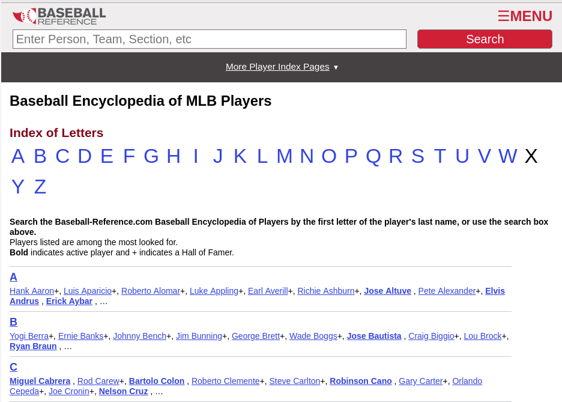

```{r setup, include=FALSE, message=FALSE, warning = FALSE}
knitr::opts_chunk$set(echo = TRUE, dpi= 300)
options(width=60)
library(tidyverse)
```


## Web Scraping 

- Transform data from web pages into usable information

- Automate the process


---

## `rvest` + `xml2`: Easy Web Scraping
  
- `read_html` gets the full set of HTML markup from a URL

```{r warning = FALSE, message = FALSE}
library(rvest)
url <- "http://www.nytimes.com/elections/results/iowa"
html <- read_html(url)
html
```

- Use `html_attr`, `html_node`, `html_table`, and `html_text` to extract useful information from the markup

---

## Get a *table* from an online source

`html_table` extracts all tables from the sourced html into a list of data frames:
  
```{r}
tables <- html %>% html_table(fill=TRUE)
tables %>% purrr::map(glimpse)
```

---

## Data Munging

Most tables need a bit of clean-up:

```{r}
ia_results <- tables[[2]] %>% mutate(
  Trump = parse_number(Trump),
  Clinton = parse_number(Clinton)
)
ia_results
```
---
class:inverse
## Your Turn 

Connect to the website of the NY Times election results at http://www.nytimes.com/elections/results/
  
- Pick your favorite state (by clicking on the state on the map)

- Use `rvest` to download the election results for the 2016 Presidential Election for all counties of your state.

- Clean up the data (numbers should be numbers).

- Convert the numbers into row-wise percentages (decide on either %Republican or %Democrat).

---
class:inverse
## Your Turn 

Can you get the data you just scraped onto a map of the counties? - Try to map the percentage you calculated to the fill-color of the counties' polygons.

You will need to `join` the percentages with the county polygons:

```{r message=FALSE}
counties <- map_data("county")
head(counties)
```

---

## Your Turn - Solution

```{r}
ia_results <- ia_results %>% mutate(
  PercDem = Clinton/(Trump + Clinton)*100,
  subregion = tolower(`Vote by county`)
) 

# Which counties don't work?
anti_join(ia_results, counties %>% filter(region=="iowa"), by="subregion")
anti_join(counties %>% filter(region=="iowa"), ia_results,  by="subregion")
```

---

## Your Turn - Solution (cont'd)

```{r}
ia_results <- ia_results %>% mutate(
  subregion = replace(subregion, subregion=="o'brien", "obrien")
) 

ia_full <- left_join(ia_results, 
                     counties %>% filter(region=="iowa"), 
                     by="subregion")
```

---

## Your Turn - Solution (cont'd)

```{r, fig.width = 6, fig.height = 4, out.width = "75%"}
ia_full %>% 
  ggplot(aes( x = long, y = lat, group = subregion)) +
  geom_polygon(aes(fill = PercDem), color = "black") + 
  scale_fill_gradient2(midpoint=50, mid = "white") +
  ggthemes::theme_map()
```

---

## Beyond tables

Sometimes data on the web is not structured as nicely... e.g. let's assume we want to get a list of all recently active baseball players from [Baseball reference](http://www.baseball-reference.com/players/)

.center[]

---

## SelectorGadget

- SelectorGadget is a javascript bookmarklet to determine the css selectors of pieces of a website we want to extract.

- Bookmark the [SelectorGadget](https://selectorgadget.com/) link, then click on it to use it (or add the chrome extension)

- When SelectorGadget is active, pieces of the website are highlighted in orange/green/red.

- Use SelectorGadget on http://www.baseball-reference.com/players/ .

- Read more details on `vignette("selectorgadget")`

If you prefer, you can also read the HTML code and create your own [CSS](https://www.w3schools.com/cssref/css_selectors.asp) or [XPATH](https://www.w3schools.com/xml/xpath_syntax.asp) selectors. 

---

## SelectorGadget Result

```{r}
url <- "http://www.baseball-reference.com/players/a/"
html <- read_html(url)
html %>% html_nodes("strong a") %>% html_text()
```

---

## Example, varied

We are, in fact, not just interested in the *names of the players*, but also in the *links* to each player's website

- `html_attr` let's us access an attribute of an html node

- `html_attrs` extracts all attributes of an html node

```{r}
html %>% html_nodes("b a") %>% html_attr(name="href")
```

---
class:inverse
## Your Turn

Use the SelectorGadget on the website for [David Aardsma](http://www.baseball-reference.com/players/a/aardsda01.shtml)

Find the css selector to extract his career statistics and load them into your R session.

Does the same code work to extract career statistics for (some of) the other players?

What other information do we need to know? - and how can we get to that?

---

## Your Turn  - Solution

```{r}
url <- "http://www.baseball-reference.com/players/a/aardsda01.shtml"
html <- read_html(url)
html %>% html_nodes(".stats_pullout .poptip") %>% html_text()
html %>% html_nodes(".stats_pullout .p1 p, .stats_pullout .p2 p, .stats_pullout .p3 p") %>% html_text()
```

---

## Your Turn  - Solution (cont'd)

Now apply to other players (with 'a' as starting letter) - first we get everything tidied up in a dataset

```{r}
url <- "http://www.baseball-reference.com/players/a/"
html <- read_html(url)
players <- html %>% html_nodes("strong a") %>% html_text()
links <- html %>% html_nodes("strong a") %>% html_attr(name="href")

bb <- tibble(players=players, links = links)
```

---

## Your Turn  - Solution (cont'd)

second, we follow the links to get to career statistics:
  
```{r}
getStats <- function(players, links) {
  s <- html_session("http://www.baseball-reference.com")
  s <- s %>% jump_to(links)
  html <- read_html(s)
  type <- html %>% html_nodes(".stats_pullout .poptip") %>% html_text() 
  values <- html %>% html_nodes(".stats_pullout .p1 p, .stats_pullout .p2 p, .stats_pullout .p3 p") %>% html_text()
  what <- html %>% html_nodes(".stats_pullout strong") %>% html_text()
  df <- tibble(player = players, link = links, type=rep(type, each=length(what)), values=values, what = rep(what, length(values)/2))
  df
}

bbhead <- bb[1:5,] %>% purrr::pmap_df(getStats)
```

---

## Your Turn  - Solution (cont'd)

We also need to know the position a player has ...

This information has the css path "#meta p:nth-child(2)"

  
```{r}
getStats <- function(players, links) {
  s <- html_session("http://www.baseball-reference.com")
  s <- s %>% jump_to(links)
  html <- read_html(s)
  type <- html %>% html_nodes(".stats_pullout .poptip") %>% html_text() 
  values <- html %>% html_nodes(".stats_pullout .p1 p, .stats_pullout .p2 p, .stats_pullout .p3 p") %>% html_text()
  what <- html %>% html_nodes(".stats_pullout strong") %>% html_text()
  position <- html %>% html_nodes("#meta p:nth-child(2)") %>% html_text(trim = T) %>%
    gsub("Position:\\n", "", x = .) %>% str_trim()
  df <- tibble(player = players, link = links, position = position, 
               type=rep(type, each=length(what)), values=values, 
               what = rep(what, length(values)/2))
  df
}

bbhead <- bb[1:5,] %>% purrr::pmap_df(getStats)
```
