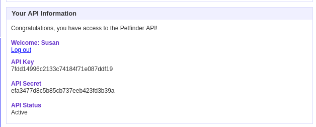
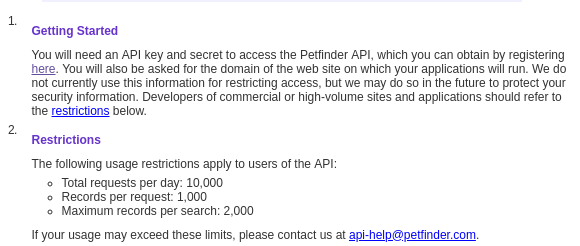
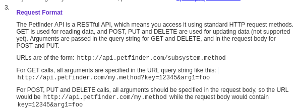
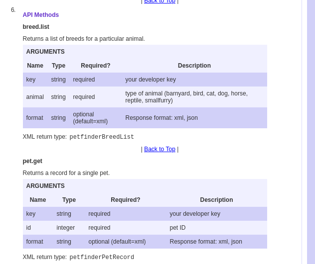
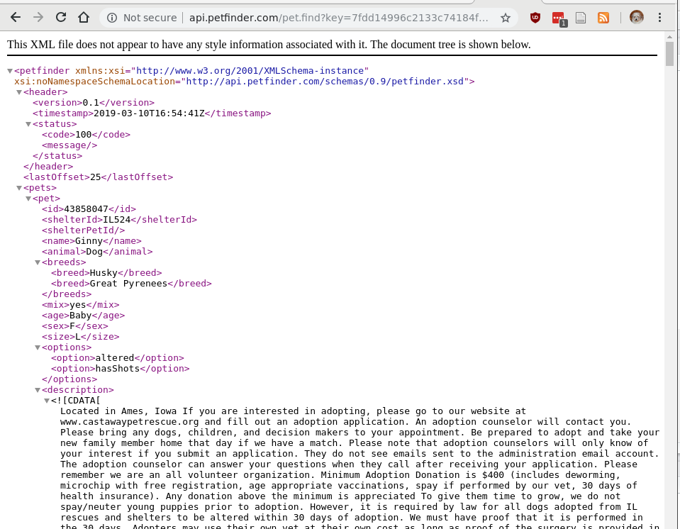

```{r setup, include=FALSE, message=FALSE, warning = FALSE}
knitr::opts_chunk$set(echo = TRUE, dpi= 300)
options(width=60)
library(tidyverse)
```


## Application Programming Interfaces (APIs)

- A set of instructions and standards for accessing structured information on the web

- A very conveninent way to get data from the internet

- Usually, takes the form:    
`http://url.com?param1=value&param2=value2`

- Intended to make data available for other applications (e.g. developers of android apps, etc.)
    - More convenient than scraping HTML directly
    - Data is usually cleaner and structured 

---

## Reading API Documentation

Most APIs come with some documentation:

- [Petfinder API](https://www.petfinder.com/developers/api-docs)

- [NOAA API](https://www.ncdc.noaa.gov/cdo-web/webservices/v2)

- [List of data.gov APIs](https://catalog.data.gov/dataset?q=-aapi+api+OR++res_format%3Aapi#topic=developers_navigation)

The documentation will tell you about 

- required authentication (and how to get an API key)
- rate limits (how many requests you can make at a time)
- query parameters and values


---

## API Authentication

Many APIs will allow you to register and obtain an API key



---

## API Rate Limits

APIs are a service provided for developers. Servers dedicated to these APIs are resource-limited, so be respectful of the data provider and the resource limits. 




---

## Getting Data



We will need to use specific methods, pass in the API key, and any method search parameters

---

## Getting Data - API Methods




---

## Getting Data - Putting it together

Let's use the `pet.find` method, and search for animals near Ames (zip code 50010)

```{r, echo = F, include = F}
library(rvest)
```
```{r, eval = -1}
library(rvest)
key <- "key=7fdd14996c2133c74184f71e087ddf19" # Get your own if you want to try this yourself
base_url <- "http://api.petfinder.com/"
method <- "pet.find"
query <- "animal=dog&location=50010"
url <- sprintf("%s%s?%s&%s", base_url, method, key, query)

ames_dogs <- read_xml(url) %>% xml_nodes("pet")
```



---
class:inverse
## Your Turn

The [ames-dogs.xml](https://raw.githubusercontent.com/Stat585-at-ISU/materials-2019/master/11_web-scraping/amesDogs.xml) file is the result from the query on the last slide. 

```{r}
url <- "https://bit.ly/2Hw6lkn"
ames_dogs <- read_xml(url) %>% xml_nodes("pet")
```

1. For the 25 dogs returned by the API, assemble a data frame with their name, age, sex, breed(s), and shelter ID.

2. For each dog, can you assemble a list of picture links? (Hint: use list columns)

---

## Your Turn Solutions

```{r}
ames_dogs <- read_xml(url) %>% xml_nodes("pet")

dog_to_df <- function(x) {
  tibble(
    name = xml_node(x, "name") %>% xml_text(),
    breed = xml_nodes(x, "breed") %>% xml_text() %>% paste(collapse = ", "),
    age = xml_node(x, "age") %>% xml_text(),
    sex = xml_node(x, "sex") %>% xml_text(),
    id = xml_node(x, "id") %>% xml_text(),
    shelterID = xml_node(x, "shelterId") %>% xml_text(),
    pics = list(xml_nodes(x, "photo") %>% xml_text())
  )
}

ames_dog_df <- ames_dogs %>% purrr::map_df(dog_to_df)
```

---

## Your Turn Solutions

```{r}
ames_dog_df
```

---

## Your Turn Solutions

```{r, fig.show = 'all'}
purrr::map_chr(ames_dog_df$pics, magrittr::extract2, 1) %>% 
  knitr::include_graphics()
```

---

## APIs and File Types

Not all APIs work with HTML/XML output data. Some return CSV, JSON, and other file types. Read the documentation and try your query out in a web browser in order to figure out how to read the responses correctly.

```{r}
jsonlite::read_json("https://api.weather.gov/points/42.0238,-93.6161")
```

---
class:inverse
## Your Turn

The NOAA Weather API has many layers. If you use the /points/ API and pass in latitude and longitude, 

`https://api.weather.gov/points/42.0238,-93.6161`

the returned JSON file provides links to other APIs. 

Use the `jsonlite` package to work with the returned JSON file (`jsonlite::fromJSON`).

Write a function that accepts latitude and longitude and returns the hourly forecast as a data frame. 

Can you plot the temperature forecast? 

---

## Your Turn Solutions

```{r}
get_weather <- function(lat, lon) {
  checkmate::assert_number(lat)
  checkmate::assert_number(lon)
  url <- sprintf("https://api.weather.gov/points/%f,%f", lat, lon)
  initialjson <- jsonlite::fromJSON(url)
  
  if (!checkmate::check_subset("properties", names(initialjson)) | 
      !checkmate::check_subset("forecastHourly", names(initialjson$properties))) {
    stop("No Information Found. Check Latitude/Longitude values.")
  }
  
  hourlyforecast <- jsonlite::fromJSON(initialjson$properties$forecastHourly)
  
  res <- hourlyforecast$properties$periods
  checkmate::check_data_frame(res)
  res
}
```

---

## Your Turn Solutions

```{r, eval = F}
amesweather <- get_weather(42, -93.6) %>%
  mutate(startTime = lubridate::ymd_hms(startTime, tz = "America/Chicago")) 

# Add icons for every 6 hour interval
maxtemp <- max(amesweather$temperature)
icons <- amesweather %>% filter(row_number() %% 6 == 1) 
icon_lst <- purrr::map2(
  icons$icon, icons$startTime, 
  ~cowplot::draw_image(.x, x = .y, y = maxtemp - 3, width = lubridate::hours(6), height = 6))

ggplot() + 
  icon_lst + 
  geom_line(aes(x = startTime, y = temperature), data = amesweather) 
```

---

## Your Turn Solutions

```{r, echo = F, fig.width = 8, fig.height = 4, include = -1}
amesweather <- get_weather(42, -93.6) %>%
  mutate(startTime = lubridate::ymd_hms(startTime, tz = "America/Chicago")) 

# Add icons for every 6 hour interval
maxtemp <- max(amesweather$temperature)
icons <- amesweather %>% filter(row_number() %% 6 == 1) 
icon_lst <- purrr::map2(
  icons$icon, icons$startTime, 
  ~cowplot::draw_image(.x, x = .y, y = maxtemp - 3, width = lubridate::hours(6), height = 6))

ggplot() + 
  icon_lst + 
  geom_line(aes(x = startTime, y = temperature), data = amesweather) 
```
